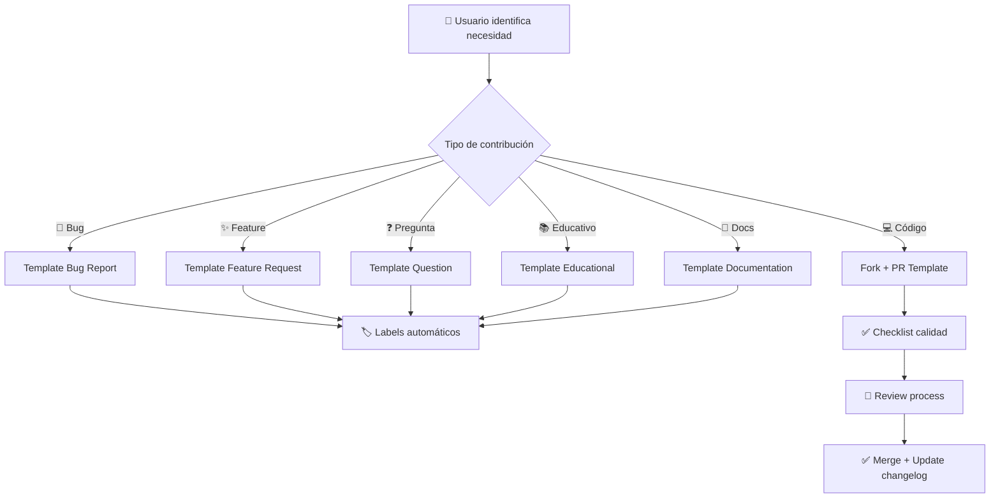

# 📋 GitHub Templates y Configuración

> **Documentación completa de todos los templates de GitHub para el bootcamp MCP Server**

## 🎯 Propósito

Este directorio contiene toda la configuración y templates necesarios para mantener un proyecto educativo de alta calidad, con procesos claros para contribuciones, reportes de issues y gobernanza de la comunidad.

## 📂 Estructura de Archivos

```
.github/
├── ISSUE_TEMPLATE/
│   ├── bug_report.md              # 🐛 Template para reportar bugs
│   ├── feature_request.md         # ✨ Template para solicitar features
│   ├── question.md                # ❓ Template para preguntas
│   ├── educational_improvement.md # 📚 Template para mejoras pedagógicas
│   ├── documentation.md           # 📖 Template para documentación
│   └── config.yml                 # ⚙️ Configuración de templates
├── PULL_REQUEST_TEMPLATE.md       # 🔄 Template para Pull Requests
├── CODE_OF_CONDUCT.md             # 🤝 Código de conducta
├── CONTRIBUTING.md                # 📋 Guía de contribución
├── copilot-instructions.md        # 🤖 Instrucciones para GitHub Copilot
└── README.md                      # 📖 Esta documentación
```

## 📋 Templates de Issues

### 🐛 Bug Report (`bug_report.md`)

**Propósito**: Reportar errores técnicos en código, documentación o ejemplos.

**Campos incluidos**:

- 📝 Descripción del bug
- 🔄 Pasos para reproducir
- 🎯 Comportamiento esperado vs actual
- 🖥️ Entorno técnico (OS, Node.js, etc.)
- 📚 Módulo del bootcamp afectado
- 📷 Screenshots (opcional)

**Labels automáticos**: `bug`, `needs-triage`

### ✨ Feature Request (`feature_request.md`)

**Propósito**: Solicitar nuevas funcionalidades, módulos o herramientas.

**Campos incluidos**:

- 🎯 Descripción de la funcionalidad
- 💡 Motivación y casos de uso
- 📋 Solución propuesta
- 🔄 Alternativas consideradas
- 📚 Impacto en el bootcamp
- 🎓 Contexto educativo

**Labels automáticos**: `enhancement`, `feature-request`

### ❓ Question (`question.md`)

**Propósito**: Hacer preguntas técnicas o conceptuales sobre el bootcamp.

**Campos incluidos**:

- ❓ Pregunta específica
- 📚 Módulo relacionado
- 🎯 Contexto del problema
- 🔍 Lo que ya se intentó
- 🎓 Nivel de experiencia

**Labels automáticos**: `question`, `help-wanted`

### 📚 Educational Improvement (`educational_improvement.md`)

**Propósito**: Sugerir mejoras en el contenido pedagógico del bootcamp.

**Campos incluidos**:

- 📋 Área de mejora
- 🎯 Problema pedagógico identificado
- 💡 Solución propuesta
- 🎓 Impacto en el aprendizaje
- 📊 Evidencia o justificación

**Labels automáticos**: `education`, `improvement`, `pedagogy`

### 📖 Documentation (`documentation.md`)

**Propósito**: Mejorar o agregar documentación.

**Campos incluidos**:

- 📄 Tipo de documentación
- 📋 Descripción del problema
- 💡 Mejora propuesta
- 🎯 Audiencia objetivo
- 📍 Ubicación sugerida

**Labels automáticos**: `documentation`, `needs-docs`

### ⚙️ Configuración (`config.yml`)

Configuración central que:

- ✅ Habilita formularios estructurados
- 🏷️ Asigna labels automáticamente
- 📋 Define templates disponibles
- 🔗 Redirige a recursos externos cuando es apropiado

## 🔄 Pull Request Template

### 📝 Template Principal (`PULL_REQUEST_TEMPLATE.md`)

**Secciones incluidas**:

1. **📋 Descripción**

   - Resumen claro del cambio
   - Contexto técnico y pedagógico
   - Motivación del cambio

2. **✅ Checklist de Calidad**

   - [ ] Código sigue las convenciones del proyecto
   - [ ] Tests agregados/actualizados
   - [ ] Documentación actualizada
   - [ ] Cambios probados localmente
   - [ ] Commit messages siguen Conventional Commits

3. **🧪 Testing**

   - Descripción de tests realizados
   - Casos edge considerados
   - Validación en diferentes entornos

4. **📚 Impacto Educativo**

   - Cómo afecta la progresión del bootcamp
   - Módulos impactados
   - Consideraciones pedagógicas

5. **🔗 Referencias**
   - Issues relacionados
   - Documentación relevante
   - Discusiones previas

## 📋 Gobernanza

### 🤝 Code of Conduct (`CODE_OF_CONDUCT.md`)

**Características**:

- 🎓 Adaptado para entorno educativo
- 🌍 Inclusivo y acogedor
- 📋 Normas claras de comportamiento
- 🚨 Proceso de reporte transparente
- 🤝 Enfoque en aprendizaje colaborativo

**Secciones**:

- Nuestro compromiso
- Nuestros estándares
- Responsabilidades de enforcement
- Alcance del código
- Proceso de reportes

### 📋 Contributing Guidelines (`CONTRIBUTING.md`)

**Estructura completa**:

1. **🎯 Visión y Valores**

   - Enfoque pedagógico
   - Calidad técnica
   - Comunidad inclusiva

2. **🚀 Formas de Contribuir**

   - Reportar bugs/mejoras
   - Contribuir código
   - Mejorar documentación
   - Ayudar en la comunidad

3. **📋 Proceso de Contribución**

   - Fork y setup del proyecto
   - Desarrollo de cambios
   - Testing y validación
   - Pull request guidelines

4. **🎓 Consideraciones Educativas**

   - Progresión pedagógica
   - Calidad del contenido
   - Accesibilidad
   - Diversidad de estilos de aprendizaje

5. **🔧 Guías Técnicas**
   - Estándares de código
   - Convenciones de commits
   - Estructura de archivos
   - Testing requirements

## 🤖 GitHub Copilot Instructions

### 📋 Configuración Pedagógica (`copilot-instructions.md`)

**Directrices incluidas**:

1. **🎯 Enfoque por Módulos**

   - Progresión pedagógica
   - Adaptación al nivel del estudiante
   - Construcción incremental de conocimiento

2. **💻 Patrones de Código MCP**

   - Estructura básica de servidores
   - Manejo de errores consistente
   - Mejores prácticas por módulo

3. **📚 Consideraciones Educativas**

   - Explicaciones detalladas para principiantes
   - Múltiples enfoques para intermedio
   - Patrones empresariales para avanzado

4. **🔧 Stack Tecnológico**
   - TypeScript como lenguaje principal
   - Node.js 18+, Python 3.11+
   - PostgreSQL, Prisma, Docker

## 📊 Métricas y Estadísticas

### 📋 Templates Disponibles

- **5 tipos** de issue templates
- **1 template** de Pull Request
- **2 documentos** de gobernanza
- **1 configuración** de Copilot

### 🎯 Cobertura Funcional

- ✅ **Reportes de bugs** técnicos
- ✅ **Solicitudes de features** con contexto pedagógico
- ✅ **Preguntas técnicas** estructuradas
- ✅ **Mejoras educativas** específicas
- ✅ **Documentación** organizada
- ✅ **Contribuciones** de calidad
- ✅ **Comunidad** saludable y educativa

### 🔄 Flujo de Trabajo



## 🚀 Uso y Mejores Prácticas

### Para Contribuidores

1. **📋 Usa el template apropiado** para cada tipo de contribución
2. **🏷️ Revisa labels** automáticos asignados
3. **📝 Completa todos los campos** requeridos
4. **🔗 Referencia issues** relacionados
5. **📚 Considera el impacto educativo** de tus cambios

### Para Mantenedores

1. **🎯 Triaje regular** de issues nuevos
2. **📋 Validación** de templates completados correctamente
3. **🤝 Enfoque educativo** en respuestas y reviews
4. **📊 Tracking** de métricas de contribución
5. **🔄 Actualización periódica** de templates según necesidades

### Para Estudiantes

1. **❓ Usa templates de preguntas** para dudas técnicas
2. **📚 Sugiere mejoras educativas** basadas en tu experiencia
3. **🐛 Reporta problemas** en ejemplos o documentación
4. **💡 Propón ejercicios** adicionales o variaciones
5. **🤝 Ayuda a otros** estudiantes en discussions

## 🔧 Mantenimiento

### Actualización de Templates

Los templates se revisan y actualizan regularmente basándose en:

- 📊 **Feedback de la comunidad**
- 📈 **Análisis de métricas** de uso
- 🎓 **Evolución del contenido** educativo
- 🔧 **Mejores prácticas** de GitHub

### Versionado

- **Cambios menores**: Mejoras en texto, correcciones
- **Cambios mayores**: Nuevos campos, reestructuración
- **Documentación**: Actualización en CHANGELOG.md

---

## 🔗 Enlaces Relacionados

- [📑 Índice Completo de Templates](../docs/TEMPLATE_INDEX.md)
- [📋 Changelog del Proyecto](../CHANGELOG.md)
- [📖 README Principal](../README.md)
- [🎯 Plan de Trabajo](../docs/plan-trabajo.md)

---

**💡 Recordatorio**: Todos estos templates están diseñados para mantener la calidad educativa y técnica del bootcamp, facilitando contribuciones constructivas y manteniendo una comunidad de aprendizaje saludable.

**🤝 ¿Necesitas ayuda?** No dudes en abrir un issue usando el template de pregunta o únete a nuestras discussions.

[⬆️ Volver al README principal](../README.md)
