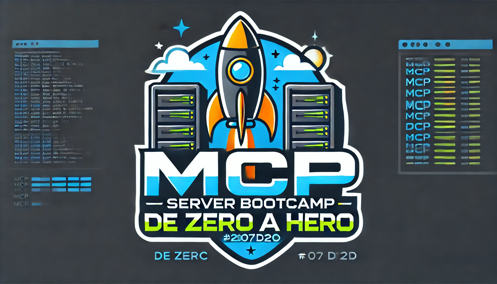

# 🚀 MCP Server Bootcamp: De Zero a Hero

<div align="center">



**Un bootcamp completo y gratuito para dominar la creación de servidores MCP**

[](https://opensource.org/)
[](https://github.com/tu-usuario/mcp-server-bootcamp)
[](https://opensource.org/licenses/MIT)
[](CONTRIBUTING.md)

[📚 Comenzar Bootcamp](#-comenzar-el-bootcamp) •
[🎯 Módulos](#-módulos) •
[🛠️ Instalación](#️-instalación) •
[🤖 Automatización](#-sistema-de-automatización) •
[📑 GitHub Templates y Configuración](#-github-templates-y-configuración) •
[🤝 Contribuir](#-contribuir) •
[💬 Comunidad](#-comunidad)

</div>

## 🎯 ¿Qué Aprenderás?

Transforma tu comprensión de los **Model Context Protocol (MCP) Servers** desde conceptos básicos hasta arquitecturas empresariales avanzadas en solo **7 semanas**:

- 🔧 **Fundamentos Sólidos**: Arquitectura, configuración y primer servidor funcional
- ⚡ **Herramientas Avanzadas**: Recursos dinámicos, prompts inteligentes e integración de APIs
- 🗄️ **Persistencia**: Bases de datos, ORMs y optimización de performance
- 🔐 **Seguridad**: Autenticación, autorización y auditoría empresarial
- 🧪 **Calidad**: Testing, CI/CD y observabilidad
- 🏗️ **Arquitecturas**: Microservicios, escalabilidad y resilencia
- 🎯 **Proyecto Real**: Aplicación completa lista para producción

## 🚀 Comenzar el Bootcamp

### Prerrequisitos

- **Node.js** 18+ y **pnpm** 8+
- **Python** 3.11+ (para ejemplos FastAPI)
- **Docker** y **Docker Compose**
- **Git** para control de versiones
- Editor como **VS Code** (configuración incluida)

### Instalación Rápida

```bash
# Clonar el repositorio
git clone https://github.com/tu-usuario/mcp-server-bootcamp.git
cd mcp-server-bootcamp

# Configurar workspace
pnpm install
pnpm run setup

# Verificar instalación
pnpm run verify-setup

# Iniciar el primer módulo
cd ejemplos/modulo-01/calculadora-basica
pnpm run dev
```

### 🐳 Desarrollo con Docker

#### Configuración Inicial

1. **Copiar las variables de entorno**:

```bash
# Crear el archivo de configuración local
cp .env.example .env
```

2. **Iniciar los servicios**:

```bash
# Levantar todos los servicios en background
docker compose up -d

# Ver el estado de los contenedores
docker compose ps
```

3. **Acceder al entorno de desarrollo**:

```bash
# Entrar al contenedor de desarrollo
docker compose exec bootcamp-dev bash

# Una vez dentro del contenedor, instalar dependencias
pnpm install

# Verificar que todo funciona
pnpm run verify-setup
```

#### Comandos Útiles de Docker

```bash
# Ver logs de todos los servicios
docker compose logs -f

# Ver logs específicos del servicio de desarrollo
docker compose logs -f bootcamp-dev

# Ver logs de la base de datos
docker compose logs -f db

# Reiniciar los servicios
docker compose restart

# Detener todos los servicios
docker compose down

# Detener y eliminar volúmenes (¡CUIDADO! Esto borra los datos de la BD)
docker compose down -v
```

#### Conectar a la Base de Datos

Desde tu máquina local, puedes conectarte a PostgreSQL usando:

- **Host**: `localhost`
- **Puerto**: `5432`
- **Usuario**: `bootcamp_user` (definido en `.env`)
- **Contraseña**: `supersecretpassword` (definido en `.env`)
- **Base de datos**: `mcp_bootcamp_db` (definido en `.env`)

#### Desarrollo en el Contenedor

```bash
# Ejecutar comandos específicos en el contenedor
docker compose exec bootcamp-dev pnpm install
docker compose exec bootcamp-dev pnpm run dev
docker compose exec bootcamp-dev pnpm test

# Trabajar de forma interactiva
docker compose exec bootcamp-dev bash
# Ahora estás dentro del contenedor y puedes ejecutar cualquier comando
```

### 🛠️ Instalación Local (Alternativa)

Si prefieres no usar Docker, puedes configurar el entorno localmente instalando las dependencias directamente en tu máquina. Asegúrate de tener instalados **Node.js**, **Python**, y **PostgreSQL**.

```bash
# Instalar dependencias de Node.js
npm install

# Instalar dependencias de Python (si es necesario)
pip install -r requirements.txt

# Iniciar el servidor
npm run dev
```

## 📋 Módulos

### 📖 [Módulo 1: Fundamentos y Conceptos Base](docs/modulos/modulo-01-fundamentos/)

**Semana 1** • Comprensión conceptual, configuración y primer servidor

- 🎯 **Días 1-2**: Arquitectura MCP y casos de uso
- 🛠️ **Días 3-4**: Entorno y calculadora inteligente
- 🔍 **Días 5-7**: Anatomía completa de servidores MCP

### ⚡ [Módulo 2: Herramientas Avanzadas y Recursos](docs/modulos/modulo-02-herramientas-avanzadas/)

**Semana 2** • Recursos dinámicos y contexto inteligente

- 📊 **Días 8-10**: Sistema de recursos y gestión de datos
- 🧠 **Días 11-12**: Prompts dinámicos y contexto adaptativo
- 🌐 **Días 13-14**: Integración con APIs externas

### 🗄️ [Módulo 3: Persistencia y Bases de Datos](docs/modulos/modulo-03-persistencia/)

**Semana 3** • Almacenamiento y optimización

- 💾 **Días 15-17**: SQLite, PostgreSQL y patrones de acceso
- 🔄 **Días 18-19**: Prisma ORM y modelado de datos
- ⚡ **Días 20-21**: Cache distribuido y optimización

### 🔐 [Módulo 4: Seguridad y Autenticación](docs/modulos/modulo-04-seguridad/)

**Semana 4** • Seguridad empresarial

- 🛡️ **Días 22-24**: Fundamentos y autenticación robusta
- 👥 **Días 25-26**: RBAC/ABAC y control granular
- 📋 **Días 27-28**: Auditoría y logging estructurado

### 🧪 [Módulo 5: Testing y Calidad](docs/modulos/modulo-05-testing/)

**Semana 5** • Calidad y automatización

- ✅ **Días 29-31**: Testing integral y mocking
- 🔄 **Días 32-33**: CI/CD y deployment automatizado
- 📊 **Días 34-35**: Monitoreo y observabilidad

### 🏗️ [Módulo 6: Arquitecturas Avanzadas](docs/modulos/modulo-06-arquitecturas-avanzadas/)

**Semana 6** • Escalabilidad empresarial

- 🔗 **Días 36-38**: Microservicios y sistemas distribuidos
- 🚀 **Días 39-40**: Performance y escalabilidad extrema
- 🛡️ **Días 41-42**: Resilencia y alta disponibilidad

### 🎯 [Módulo 7: Proyecto Final](docs/modulos/modulo-07-proyecto-final/)

**Semana 7** • Aplicación tu expertise

- 📋 **Días 43-45**: Diseño de arquitectura completa
- 💻 **Días 46-47**: Implementación con mentoría
- 🚀 **Días 48-49**: Deployment y presentación

## 🛠️ Tecnologías Principales

<div align="center">

| Tecnología                                                                                               | Uso                  | Versión |
| -------------------------------------------------------------------------------------------------------- | -------------------- | ------- |
|  | Desarrollo principal | 5.0+    |
|           | Runtime JavaScript   | 18+     |
|              | Ejemplos FastAPI     | 3.11+   |
|              | Contenedorización    | Latest  |
|  | Base de datos        | 15+     |
|              | ORM                  | 5.0+    |

</div>

## 🤖 Sistema de Automatización

Este bootcamp incluye un sistema completo de automatización para garantizar calidad y facilitar el desarrollo:

### ⚡ Autocommit Inteligente

```bash
# El sistema ejecuta automáticamente cada 10 minutos:
- Detección inteligente de cambios por módulo
- Commits con Conventional Commits estándar
- Actualización automática del CHANGELOG.md
- Logs detallados con rotación automática
```

**Características:**

- 🧠 **Detección Inteligente**: Categoriza cambios por tipo y módulo
- 📝 **Conventional Commits**: Mensajes semánticos automáticos
- 📋 **Changelog Automático**: Generación basada en commits
- 🔒 **Ejecución Segura**: Sistema de locks y manejo de errores
- 📊 **Logging Completo**: Auditoría detallada con rotación

### 🔧 Scripts de Automatización

| Script                        | Propósito                        | Uso                             |
| ----------------------------- | -------------------------------- | ------------------------------- |
| `scripts/setup.sh`            | Configuración inicial completa   | `./scripts/setup.sh`            |
| `scripts/autocommit.sh`       | Commits automáticos inteligentes | Ejecuta vía cron                |
| `scripts/update-changelog.sh` | Actualización del CHANGELOG      | `./scripts/update-changelog.sh` |
| `scripts/build-all.sh`        | Build de todos los módulos       | `./scripts/build-all.sh`        |
| `scripts/lint.sh`             | Linting y formato de código      | `./scripts/lint.sh`             |

### 📋 Control y Configuración

```bash
# Gestión del sistema de autocommit
./scripts/setup-autocommit.sh    # Activar autocommit
./scripts/remove-autocommit.sh   # Desactivar autocommit
./scripts/autocommit-config.sh   # Configurar parámetros

# Logs y monitoreo
tail -f .autocommit/autocommit.log        # Ver logs en tiempo real
tail -f .autocommit/changelog-generator.log # Ver logs de changelog
```

## 📑 GitHub Templates y Configuración

Este proyecto está equipado con un conjunto completo de templates y archivos de configuración para estandarizar las contribuciones, facilitar la gestión y mantener una alta calidad en el código y la documentación.

### 📂 Estructura de `.github`

La carpeta `.github` centraliza toda la configuración relacionada con la comunidad y las contribuciones en GitHub.

<div align="center">

</div>

### 🔧 Configuración del Proyecto

| Archivo                                                              | Propósito                             | Ubicación         |
| -------------------------------------------------------------------- | ------------------------------------- | ----------------- |
| [`.gitignore`](.gitignore)                                           | Exclusiones de Git para todo el stack | Raíz del proyecto |
| [`pnpm-workspace.yaml`](pnpm-workspace.yaml)                         | Configuración del workspace           | Raíz del proyecto |
| [`tsconfig.json`](tsconfig.json)                                     | Configuración TypeScript global       | Raíz del proyecto |
| [`.github/copilot-instructions.md`](.github/copilot-instructions.md) | Directrices para GitHub Copilot       | `.github/`        |

### 📋 Templates de Issues

| Template                                                                        | Propósito                               | Ubicación                 |
| ------------------------------------------------------------------------------- | --------------------------------------- | ------------------------- |
| [🐛 Bug Report](.github/ISSUE_TEMPLATE/bug_report.md)                           | Reportar errores técnicos               | `.github/ISSUE_TEMPLATE/` |
| [✨ Feature Request](.github/ISSUE_TEMPLATE/feature_request.md)                 | Solicitar nuevas funcionalidades        | `.github/ISSUE_TEMPLATE/` |
| [❓ Question](.github/ISSUE_TEMPLATE/question.md)                               | Hacer preguntas técnicas o conceptuales | `.github/ISSUE_TEMPLATE/` |
| [📚 Educational Improvement](.github/ISSUE_TEMPLATE/educational_improvement.md) | Mejorar contenido pedagógico            | `.github/ISSUE_TEMPLATE/` |
| [📖 Documentation](.github/ISSUE_TEMPLATE/documentation.md)                     | Mejorar o agregar documentación         | `.github/ISSUE_TEMPLATE/` |
| [⚙️ Config](.github/ISSUE_TEMPLATE/config.yml)                                  | Configuración de templates              | `.github/ISSUE_TEMPLATE/` |

### 🔄 Templates de Pull Request

| Template                                                     | Propósito                           | Ubicación  |
| ------------------------------------------------------------ | ----------------------------------- | ---------- |
| [📝 Pull Request Template](.github/PULL_REQUEST_TEMPLATE.md) | Guía para contribuciones de calidad | `.github/` |

### 📋 Gobernanza del Proyecto

| Documento                                             | Propósito                                | Ubicación         |
| ----------------------------------------------------- | ---------------------------------------- | ----------------- |
| [🤝 Code of Conduct](.github/CODE_OF_CONDUCT.md)      | Normas de convivencia en la comunidad    | `.github/`        |
| [📋 Contributing Guidelines](.github/CONTRIBUTING.md) | Guía completa para contribuir            | `.github/`        |
| [📊 Changelog](CHANGELOG.md)                          | Historial de cambios del proyecto        | Raíz del proyecto |
| [🔒 Security Policy](SECURITY.md)                     | Política de seguridad y vulnerabilidades | Raíz del proyecto |

### 🏗️ Plantillas de Desarrollo

| Plantilla                                                           | Propósito                                  | Ubicación     |
| ------------------------------------------------------------------- | ------------------------------------------ | ------------- |
| [`servidor-base/`](plantillas/servidor-base/)                       | Estructura base para nuevos servidores MCP | `plantillas/` |
| [`testing-setup/`](plantillas/testing-setup/)                       | Configuración de testing completa          | `plantillas/` |
| [`docker-compose-templates/`](plantillas/docker-compose-templates/) | Templates para Docker Compose              | `plantillas/` |
| [`deployment-configs/`](plantillas/deployment-configs/)             | Configuraciones de deployment              | `plantillas/` |

### 🐳 Configuración Docker

| Archivo                                                        | Propósito                   | Ubicación              |
| -------------------------------------------------------------- | --------------------------- | ---------------------- |
| [`node.Dockerfile`](herramientas/docker/node.Dockerfile)       | Imagen base para Node.js    | `herramientas/docker/` |
| [`python.Dockerfile`](herramientas/docker/python.Dockerfile)   | Imagen base para Python     | `herramientas/docker/` |
| [`compose-templates/`](herramientas/docker/compose-templates/) | Templates de Docker Compose | `herramientas/docker/` |

### 🔍 Validadores y Herramientas

| Herramienta                               | Propósito                       | Ubicación       |
| ----------------------------------------- | ------------------------------- | --------------- |
| [`validators/`](herramientas/validators/) | Scripts de validación de código | `herramientas/` |

---

**💡 Consejo**: Todos los templates están diseñados para ser pedagógicamente efectivos y técnicamente robustos, siguiendo las mejores prácticas de la industria y adaptados al contexto educativo del bootcamp.

## 📊 Evaluación y Certificación

Cada módulo incluye:

- ✅ **Rúbricas detalladas** con criterios claros
- 🎯 **Ejercicios prácticos** con soluciones
- 🏆 **Proyectos incrementales** que construyen expertise
- 📈 **Auto-evaluación** y peer review

## 🤝 Contribuir

¡Tu contribución hace que este bootcamp sea mejor para todos!

### Formas de Contribuir

- 🐛 **Reportar bugs** o mejoras en el contenido
- 📝 **Mejorar documentación** y ejemplos
- 💡 **Proponer nuevos módulos** o ejercicios
- 🌍 **Traducir contenido** a otros idiomas
- ⭐ **Compartir y dar estrella** al repositorio

### Proceso de Contribución

1. **Fork** el repositorio
2. **Crea una rama** para tu feature: `git checkout -b feature/nueva-funcionalidad`
3. **Commits descriptivos**: `git commit -m 'feat: agregar ejercicio de WebSockets'`
4. **Push** a tu fork: `git push origin feature/nueva-funcionalidad`
5. **Pull Request** con descripción detallada

Lee nuestra [**Guía de Contribución**](CONTRIBUTING.md) para más detalles.

## 📜 Licencia

Este proyecto está licenciado bajo la **MIT License** - mira el archivo [LICENSE](LICENSE) para detalles.

## 💬 Comunidad

<div align="center">

[](https://discord.gg/tu-server)
[](https://github.com/tu-usuario/mcp-server-bootcamp/discussions)
[](https://twitter.com/tu-handle)

**¿Tienes preguntas?** Únete a nuestras discusiones o crea un issue.

**¿Quieres mantenerte actualizado?** Síguenos y dale ⭐ al repositorio.

</div>

---

<div align="center">

**Hecho con ❤️ para la comunidad de desarrolladores MCP**

[⬆️ Volver arriba](#-mcp-server-bootcamp-de-zero-a-hero)

</div>
